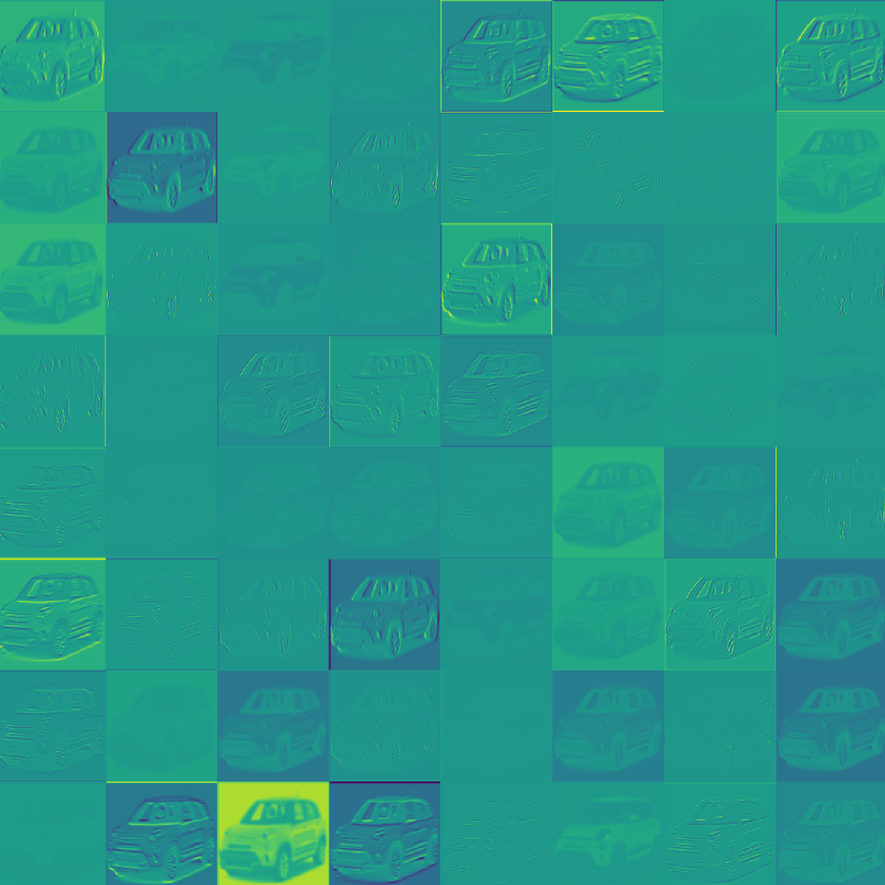
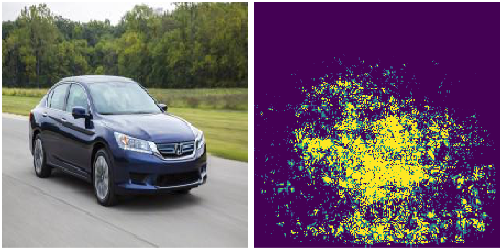
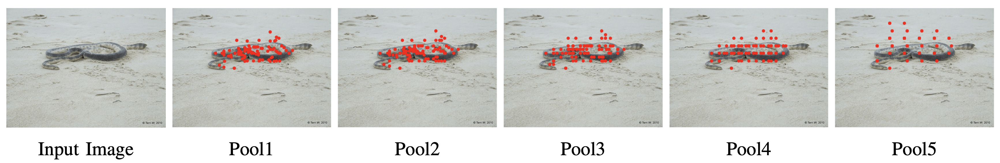
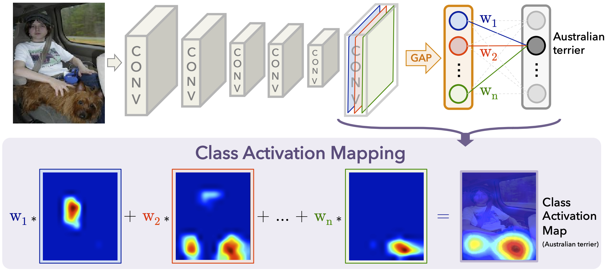

## Interpretability of Deep Learning Models with Grad-CAM

In the [first post]() (TODO: link), we built a model using transfer learning to classify the car model given an image of a car. In the [second post]() (TODO: link), we showed how TensorFlow Serving can be used to deploy a TensorFlow model using the car model classifier as an example. We dedicate this third post to another important aspect of deep learning and machine learning in general: interpretability of model predictions.

We will start with a short general introduction to the topic of explainability in machine learning. Next, we will briefly talk about popular methods that can be used to explain and interpret predictions from CNNs. We will then explain Grad-CAM, a gradient-based method, in depth by going through an implementation step by step. Finally, we will show the results obtained by our Grad-CAM implementation for the car model classifier.

### A Brief Introduction on Explainability in Machine Learning

For the last couple of years, explainability was always a recurring but still niche topic in machine learning. But, in the last three years, interest in this topic has started to accelerate. There is at least one particular reason that fuelled this development: the increased number of machine learning models in production. This leads, on the one hand, to a growing number of end users who need to understand how models are making decisions. On the other hand, a growing number of machine learning developers need to understand why (or why not) a model is functioning in a particular way. 

This increasing demand in explainability led to some, both methodological and technical, noteworthy inovations in the last years:

- [LIME (Local Interpretable Model-agnostic Explanations)](https://arxiv.org/pdf/1602.04938.pdf) - a model agnostic explanation technique that uses an interpretable local surrogate model.
- [SHAP (SHapley Additive exPlanations)](http://papers.nips.cc/paper/7062-a-unified-approach-to-interpreting-model-predictions.pdf) - a method inspired by game theory.
- [CAM (Class Activation Mapping)](http://cnnlocalization.csail.mit.edu/Zhou_Learning_Deep_Features_CVPR_2016_paper.pdf) - a method to indicate discriminative image regions used by the CNN to identify a certain category (e.g. in classification tasks).

### Methods for Explaining CNN Outputs for Images

Deep neural networks and especially complex architectures like CNNs were long considered as pure blackbox models. As writen above, this changed in recent years and now there are various methods avilable to explain CNNs. For example the excellent [tf-explain](https://github.com/sicara/tf-explain) library (which we used to create the examples below) implemets a wide range of usefull methods for TensorFlow 2.x. We will now briefly talk about the ideas of different approaches before turning to Grad-CAM:

**Activations Visualization:** This is the most straight forward visualization technique. It simply shows the output of a certain layer within the network during the forward pass. It can be helpful to get a feel for the extracted features, since during training most of the activations tend towards zero (when using ReLu-actvation). An example for the output of the first convolutional layer of the car model classifier is shown below:



**Vanilla Gradients**: One can use the vanilla gradients of the predicted classes' output with respect to the input image to derive input pixel importances.



We can see that the highlighted region is mostly focussed on the car. Compared to other methods discussed below, the discriminative region is much less confined.

**Occlusion Sensitivity:** This approach computes the importance of certain parts of the input image by reevaluating the model's prediction with different parts of the input image hidden. Parts of the image are hidden iteratively by replacing them by grey pixels. The weaker the prediction gets with a part of the image hidden, the more important this part is for the final prediction. Based on the discriminative power of the regions of the image, a heatmap can be constructed and plotted. Applying occlusion sensitivity for our car model classifier did not yield any meaningful results. Thus, we show [tf-explain](https://github.com/sicara/tf-explain)'s sample image. It shows the result of applying the occlusion sensitivity procedure for a cat image.


**CNN Fixations:** Another interesting approach called CNN Fixations was introduced in [this paper](https://arxiv.org/abs/1708.06670). The idea is to backtrack which neurons where important in each layer, given the activations from the forward pass and the network weights. The neurons with large influence are refered to as fixations. This approach thus allows to find the important regions for obtaining the result without the need for any recomputation (as e.g. in the case of occlusion sensitivity above, where multiple predictions must be made). The procedure can be described as follows: The node corresponding to the class is chosen as the fixation in the output layer. Then, the fixations for the previous layer are computed by computing which of the nodes have the most impact on the next higher level's fixations determined in the last step. The node importance is computed by multiplying activations and weights. If you are interested in the details of the procedure, check out [the paper](https://arxiv.org/abs/1708.06670) or the corresponding [github repo](https://github.com/val-iisc/cnn-fixations). This backtracking is done untill the input image is reached, yielding a set of pixels with large discriminative power. An example from the paper is shown below.



**CAM:** Introduced in [this paper](https://arxiv.org/abs/1512.04150), class activation mapping (CAM) is a procedure to find the discriminative region(s) for a CNN prediction by computing class activation maps. A large drawback of this procedure is that it requires the network to use global average pooling (GAP) as the last step before the prediction layer. It thus is not possible to apply this approach to general CNNs. An example is shown in the figure below (taken from the [CAM paper](https://arxiv.org/abs/1512.04150)):



The class activation map assigns an importance to every position (x, y) in the last convolutional layer by computing the linear combination of the activations, weighted by the corresponding output weights for the observed class (Australian terrier in the example above). The resulting class activation mapping is then upsampled to the size of the imput image. This is depicted by the heat map above. Due to the architecture of CNNs, the activation e.g. in the top left for any layer is directly related to the top left of the input image. This is why we can conclude which regions of the input are important by only looking at the last CNN layer.

The Grad-CAM procedure we will discuss in detail below is a generalization of CAM. Grad-CAM can be applied to networks with general CNN architectures, also ones containing multiple fully connected layers at the output.

### Grad-CAM

Grad-CAM extends the applicability of the CAM procedure by incorporating gradient information. Specifically, the gradient of the loss w.r.t. the last convolutional layer determines the weight for each of its feature maps. As in the CAM procedure above, the further steps then are to compute the weighted sum of the activations and then upsampling the result to the image size so we can plot the original image with the obtained heatmap. We will now show and discuss the code that can be used to run Grad-CAM. The full code is available [here](https://github.com/fabianmax/car-classification/blob/master/car_classifier/grad_cam.py) on GitHub.

```python
import pickle
import tensorflow as tf
import cv2
from car_classifier.modeling import TransferModel

INPUT_SHAPE = (224, 224, 3)

# Load list of targets
file = open('.../classes.pickle', 'rb')
classes = pickle.load(file)

# Load model
model = TransferModel('ResNet', INPUT_SHAPE, classes=classes)
model.load('...')

# Gradient model, takes the original input and outputs tuple with:
# - output of conv layer (in this case: conv5_block3_3_conv)
# - output of head layer (original output)
grad_model = tf.keras.models.Model([model.model.inputs],
                                   [model.model.get_layer('conv5_block3_3_conv').output,
                                    model.model.output])

# Run model and record outputs, loss, and gradients
with tf.GradientTape() as tape:
    conv_outputs, predictions = grad_model(img)
    loss = predictions[:, label_idx]

# Output of conv layer
output = conv_outputs[0]

# Gradients of loss w.r.t. conv layer
grads = tape.gradient(loss, conv_outputs)[0]

# Guided Backprop (elimination of negative values)
gate_f = tf.cast(output > 0, 'float32')
gate_r = tf.cast(grads > 0, 'float32')
guided_grads = gate_f * gate_r * grads

# Average weight of filters
weights = tf.reduce_mean(guided_grads, axis=(0, 1))

# Class activation map (cam)
# Multiply output values of conv filters (feature maps) with gradient weights
cam = np.zeros(output.shape[0: 2], dtype=np.float32)
for i, w in enumerate(weights):
    cam += w * output[:, :, i]

# Or more elegant: 
# cam = tf.reduce_sum(output * weights, axis=2)

# Rescale to org image size and min-max scale
cam = cv2.resize(cam.numpy(), (224, 224))
cam = np.maximum(cam, 0)
heatmap = (cam - cam.min()) / (cam.max() - cam.min())
```

* The first step is to load an instance of the model.
* Then, we create a new `keras.Model` instance that has two outputs: The activations of the last CNN layer (`'conv5_block3_3_conv'`) and the original model output.
* Next, we run a forward pass for our new `grad_model` using as input an image ( `img`) of shape (1, 224, 224, 3), preprocessed with the `resnetv2.preprocess_input` method. [`tf.GradientTape`](https://www.tensorflow.org/api_docs/python/tf/GradientTape) is set up and applied to record the gradients (the gradients are stored in the `tape` object). Further, the outputs of the convolutional layer (`conv_outputs`) and the head layer (`predictions`) are stored as well. Finally, we can use `label_idx` to get the loss corresponding to the label we want to find the discriminative regions for.
* Using the `gradient`-method, one can extract the desired gradients from `tape`. In this case, we need the gradient of the loss w.r.t. the output of the convolutional layer.
* In a further step, guided backdrop is applied. Only values for the gradients are kept where both the activations and the gradients are positive. This essentially means restricting attention to the activations which positively contribute to the wanted output prediction.

* The `weights` are computed by averaging the obtained guided gradients for each filter.
* The class activation map `cam`  then is computed as the weighted average of the feature map activations (`output`). The method containing the for loop above helps understanding what the function does in detail. A less straight forward but more efficient way to implement the CAM-computation is to use `tf.reduce_mean` and is shown in the commented line below the loop implementation.
* Finally, the resampling (resizing) is done using OpenCV2's `resize` method and the heatmap is rescaled to contain values in [0, 1] for plotting.

A version of Grad-CAM is also implemented in [tf-explain](https://github.com/sicara/tf-explain#vanilla-gradients).

### Examples

We now use the Grad-CAM implementation to interpret and explain the predictions of the `TransferModel` for car model classification. We start by looking at car images taken from the front.

*Grad-CAM for car images from the front*

The red regions highlight the most important discriminative regions, the blue region the least important. We can see that, for images from the front, the CNN focusses on the car's grille and the region containing the logo. If the car is slightly tilted, the focus is shifted more to the edge of the car. This is also the case for slightly tilted images from the back of cars, as can be seen in the middle image below.

*Grad-CAM for car images from the back*

For car images from behind, the most important discriminative region is near the number plate. As mentioned above, for cars looked at from an angle, the closest corner has the highest discriminative power. A very interesting example is the Mercedes-Benz C-class on the right side, where the model not only focusses on the tail lights but also puts the highest discriminative power on the model lettering.

*Grad-CAM for car images from the side*

When looking at images from the side, we notice the discriminative region is restricted to the bottom half of the cars. Again, the angle the car image was taken from determines the shift of the region towards the front or back corner.

In general, the most important fact is that the discriminative areas are always confined to parts of the cars. There are no images where the background has high discriminative power. Looking at the heatmaps and the associated discriminative regions can be used as a sanity check for the model.

### Conclusion

We discussed multiple approaches to explain CNN classifier outputs. We introduced Grad-CAM in detail by discussing the code and looking at examples for the car model classifier. Most notably, the discriminative regions highlighted by the Grad-CAM procedure are always focussed on the car and never on the backgrounds of the images. The result shows that the model works as we expect and indeed uses specific parts of the car to discriminate between different models.

In the last part of the series, we will show how the car classifier can be built in to an web application using [Dash](https://plotly.com/dash/). See you soon!

[author class="mtl" title="Über den Autor"]