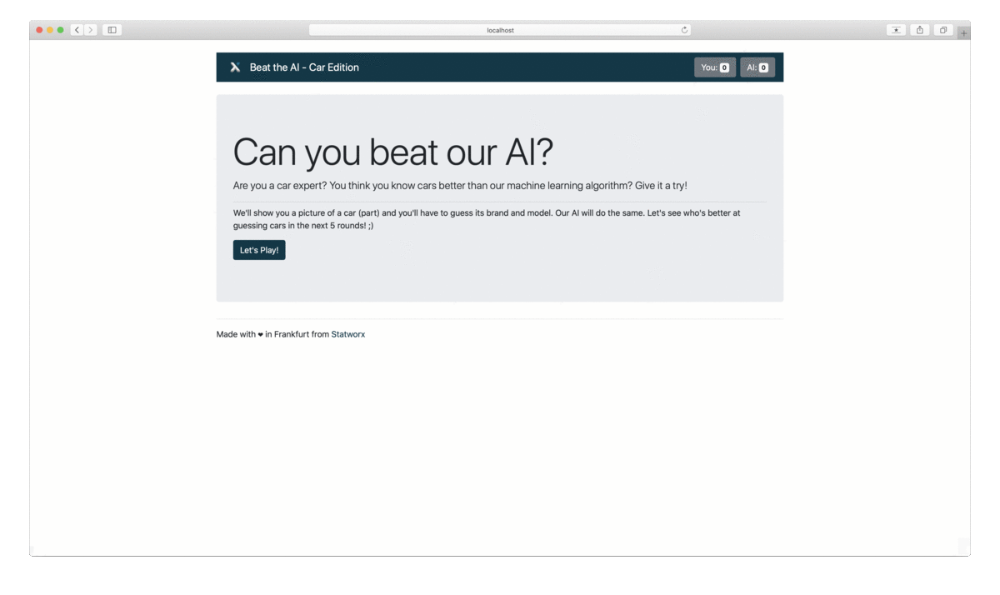

# Integrating Deep Learning Models with Dash
In the last three posts of this series, we explained how to train a deep-learning model to classify a car by its brand and model given an image of a car (Part 1; Include link), how to deploy that model from a docker container with TensorFlow Serving (Part 2; Include link) and how to explain the model's predictions (Part 3; Include link). In this post, we'll teach you how to build a good looking interface around our car classifier.

We'll transform our machine learning predictions and explanations into a fun and exciting game. We present the user an image of a car. The user has to guess what kind of car model and brand it is - the machine learning model will do the same. After 5 rounds, we'll evaluate who is better in prediction the car brand - the user or the model.



## What is Dash?
[Dash](https://dash.plotly.com/), as the name suggests, is a software made to build dashboards in Python. In Python, you ask? Yes - you do not need to code anything directly in HTML or Javascript (although a basic understanding of HTML certainly helps). For a good first introduction, please check out the excellent [blog post](https://www.statworx.com/ch/blog/how-to-build-a-dashboard-in-python-plotly-dash-step-by-step-tutorial/) from my colleague Alexander. To make the layout and styling of our web app easier, we also use [dash bootstrap components](https://dash-bootstrap-components.opensource.faculty.ai/). They follow largely the same syntax as normal dash components and integrate seamlessly into the dash experience. 

Keep in mind that Dash is made for dashboards - which means it's made for interactivity, but not necessarily for apps which have several pages. Anyways, we are going to push Dash to its limits. 

## Project Structure
To replicate everything, you might want to check out our [GitHub repository](https://github.com/fabianmax/car-classification/tree/master/dashboard) where all files are available. Also, you can launch all docker container with one click and start playing.

The files for the frontend itself are logically split into several parts. Although it's possible to write everything into one file, it's easy to lose the overview and subsequential hard to maintain. The files follow the structure of the article. First, in one file the whole layout is defined. Every button, headline, text is defined there. Second, in another file, the whole dashboard logic, so-called callbacks, are defined. Things like, what's going to happen after the user clicks are button are defined there. Third, we need a module which selects 5 random images and handles the communication with the prediction and explainable API. Lastly, there are two files which are the main entry points to launch the app.

### Entry Points
Let's start with the main entry point for our dashboard. If you know how to write a web app, like a Dash application or also a Flask app, you are familiar with the concept of an app instance. In simple terms, the app instance is everything. It contains the configuration for the app and eventually the whole layout. In our case, we initialize the app instance directly with the Bootstrap CSS files to make the styling easier. In the same step, we expose the underlying flask app. The flask app is used to serve the frontend in a productive environment. 

```python
# Initialize Dash App with Bootstrap CSS
app = dash.Dash(
    __name__,
    external_stylesheets=[dbc.themes.BOOTSTRAP],
)

# Underlying Flask App for productive deployment
server = app.server
```

This setting is used for every Dash application. In contrast to a dashboard, we need a way to handle several URL paths. More precise, if the user enters `/attempt` we want to give him the opportunity to guess a car, if he enters `/result` we want to show the result of his prediction. First, we define the layout. Notable, it is initially basically empty. You find a special Dash Core Component there. It is used to store the current URL there. This component works in both ways. With a callback, we can read the content, figure out which page the user wants to access and render the layout accordingly. We can also manipulate the content of this component, which is practically speaking a redirection to another site. The empty `div` is used as a placeholder for the actual layout.

```python
# Set Layout
app.layout = dbc.Container(
    [dcc.Location(id='url', refresh=False),
     html.Div(id='main-page')])
```

The magic happens in the following function. The function itself has one argument, the current path as a string. Based on this input, it returns the right layout. For example, the user accesses the page for the first time, the path is `/`and, therefore, the layout is `start_page`. We'll talk in a bit about the layout in detail, for now just note that we always pass an instance of the app itself and the current game state to every layout.

To get this function actually working we have to decorate it with the callback decorator. Every callback needs at least one input and at least one output. A change in the input triggers the function. The input is simply the location component defined above, with the property `pathname`. In simple terms, for whatever reason the path changes, this function gets triggered. The output is the new layout, rendered in the previously initially empty div. 

```python
@app.callback(Output('main-page', 'children'), [Input('url', 'pathname')])
def display_page(pathname: str) -> html:
    """Function to define the routing. Mapping routes to layout.

    Arguments:
        pathname {str} -- pathname from url/browser

    Raises:
        PreventUpdate: Unknown/Invalid route, do nothing

    Returns:
        html -- layout
    """
    if pathname == '/attempt':
        return main_layout(app, game_data, attempt(app, game_data))

    elif pathname == '/result':
        return main_layout(app, game_data, result(app, game_data))

    elif pathname == '/finish':
        return main_layout(app, game_data, finish_page(app, game_data))

    elif pathname == '/':
        return main_layout(app, game_data, start_page(app, game_data))

    else:
        raise PreventUpdate
```

### Layout
Let's start with the layout of our app - how should it look like? We opted for a rather simple one. As you can see in the animation above, the app consists of three parts. The header, the main content and the footer. The header and footer are the same at every page, just the main content changes. Some layouts from the main content are normally rather difficult to build. For example, the result page consists of four boxes. The boxes should always have the same width of exactly half of the used screen size but can vary in height depending on the image size. However, they are not allowed to overlap, and so on. Not even talking about the cross-browser incompatibilities. I guess you can imagine that we could have to spend easily several workdays just to figure out the optimal layout. Luckily, we can rely once again on [Bootstrap](https://getbootstrap.com) and the [Bootstrap Grid System](https://getbootstrap.com/docs/4.4/layout/grid/). The main idea is, that you can create as many rows as you want (2 in the case of the result page) and up to 12 columns per row (2 for the result page). The 12 columns limit is based upon the fact that Bootstrap divides the page internally in 12 equally sized columns. You just have to define with a simple CSS class how big the column should be. Even cooler, you can set several layouts depending on the screen size. So it would not be difficult to make our app fully responsive. 

Coming back to the Dash part, we build a function for every independent layout piece. The header, footer and one for every URL the user could access. For the header it looks like this:

```python
def get_header(app: dash.Dash, data: GameData) -> html:
    """Layout for the header

    Arguments:
        app {dash.Dash} -- dash app instance
        data {GameData} -- game data

    Returns:
        html -- html layout
    """
    logo = app.get_asset_url("logo.png")

    score_user, score_ai = count_score(data)

    header = dbc.Container(
        dbc.Navbar(
            [
                html.A(
                    # Use row and col to control vertical alignment of logo / brand
                    dbc.Row(
                        [
                            dbc.Col(html.Img(src=logo, height="40px")),
                            dbc.Col(
                                dbc.NavbarBrand("Beat the AI - Car Edition",
                                                className="ml-2")),
                        ],
                        align="center",
                        no_gutters=True,
                    ),
                    href="/",
                ),
                # You find the score counter here; Left out for clarity
            ],
            color=COLOR_STATWORX,
            dark=True,
        ),
        className='mb-4 mt-4 navbar-custom')

    return header
```

Here you see again, that we pass the app instance and the global game data state to the layout function. In a perfect world, we do not have to mess around with either one of these variables in the layout. Unfortunately, that's one of the limitations of Dash. A perfect separation of layout and logic is not possible. The app instance is needed to tell the web-server to serve the Statworx logo as a static file. Of course, you could serve the logo from an external server, in-fact we do this for the car images, but just for one logo, it would be a bit of an overkill. The game data, we need to calculate the current score from the user and the AI. Everything else is either normal HTML or Bootstrap components. If you are not familiar with that, I can refer once again to the [blog post](https://www.statworx.com/ch/blog/how-to-build-a-dashboard-in-python-plotly-dash-step-by-step-tutorial/) from my colleague Alexander or to one of the several HTML tutorials in the internet.

### Callbacks
As mentioned before, callbacks are the goto way to make the layout interactive. In our case, they mainly consist of handling the dropdown as well as the buttons clicks. While the dropdowns were rather straight forward to program, the buttons caused us some headache. 

Following good programming standards, every function should have exactly one responsibility. Therefore, we set up one callback for every button. After some kind of input validation and data manipulation, the ultimate goal is to redirect the user to the next site. While the input for the callback is the button click event and potentially some other kind of input forms, the output is always the Location component to redirect the user. Unfortunately, Dash does not allow to have more than [one callback to the same output](https://community.plot.ly/t/you-have-already-assigned-a-callback-to-the-output/25334). Therefore, we were forced to squeeze the logic for every button into one function. Since we needed to validate the user input at the attempt page, we passed the current values from the dropdown to the callback. While that worked perfectly fine for the attempt page, the button at the result page stopped working, since there are no dropdowns available to pass into the function. We had to include hidden non-functional dummy dropdown into the result page, just to get the button working again. While that is a solution, and it works perfectly fine in our case, it might be too complicated for a bigger application.

### Data
Till now, we have a beautiful app, with working buttons and so on, but the data are still missing. We have to include images, predictions and explanations into the app. 

The high-level idea is that every component runs by his own - for example in his own docker container with his own webserver. Everything is just loosely coupled together via APIs. The flow is the following:

- Step 1:
Request a list of all available car images. Randomly select 5 and request these images from the webserver.

- Step 2:
For all of the 5 images, send a request to the prediction API and parse the result from the API.

- Step 3:
Once again, for all 5 images, send these to the explainable API and save the returned image.

Now combine every output into the GameData class.

Currently, we save the game data instance as a global variable. That allows us to access it from everywhere. While this is, in theory, a smart idea, it won't work if more than one user tries to access the app. The second user will see the game state from the first one. Since we are planning to show this game on a big screen at fairies it's fine for now. In the future, we might launch the dashboard with [Shiny Proxy](https://www.shinyproxy.io/), so every user gets his own docker container with an isolated global state.

The native Dash way is to store user-specific states into a Store component. It's basically the same as the Location component explained above. The data are stored into the web browser, a callback is triggered and the data are sent to the server. The first drawback is, that we always have to transfer the whole game data instance from the browser to the server, on every page change. This might cause quite a traffic and slows down the whole app experience. Moreover, if we want to change the game state, we have to do this from one callback. The one callback per output limitation also applies here. In our opinion, it does not matter too much if you have a classic dashboard, what Dash is meant for. The responsibilities are separated. In our case, the game state is accessed and modified from several components. We definitely pushed Dash to its limits.

Another thing you should keep in mind if you decide to build your own microservice app is the performance of the API calls. Initially, we used the famous [requests](https://requests.readthedocs.io/en/master/) library. While we are big fans of this library, all requests are blocking. Therefore, the second request gets executed once the first one finished. Since our request are relatively slow (keep in mind there are full fletch neural networks in the background), the app spends a lot of time just waiting. We implemented asynchronous calls with the help of the [aiohttp](https://aiohttp.readthedocs.io/en/stable/) library. All requests are now sent out in parallel. The app spends less time waiting and the user is earlier ready to play.


## Conclusion and Caveats
Even though the web app works perfectly fine, there are a few things to keep in mind. We used dash well-knowing that it's meant as a dashboarding tool. We pushed it to the limits and beyond, which lead to some ~~suboptimal~~ interesting design choices.

For example, you can just set one callback per output parameter. Several callbacks for the same output are currently not possible. Since the routing from one page to another is essentially a change in the output parameter ('url', 'pathname'), every page change has to be routed through one callback. That increase the complexity of the code exponential. 

Another problem is the difficulty to store states across several sites. Dash offers the possibility to store user data in the frontend with the [Store Component](https://dash.plotly.com/dash-core-components/store). That's an excellent solution for small apps, with larger ones you face quickly the same problem as above - just one callback, one function to write to the store, is simply not enough. You can either use Python's global state, which makes it difficult if several users access the page at the same time or you include a [cache](https://dash.plotly.com/performance)

In our blog series, we showed you how to the whole lifecycle of a data science project. From data exploration over model training to deployment and visualization. That is the last post of this series, but we hope you learned while reading these post as much as we did while building the application. 