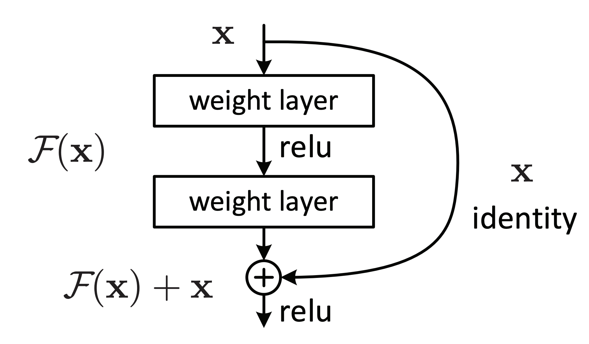
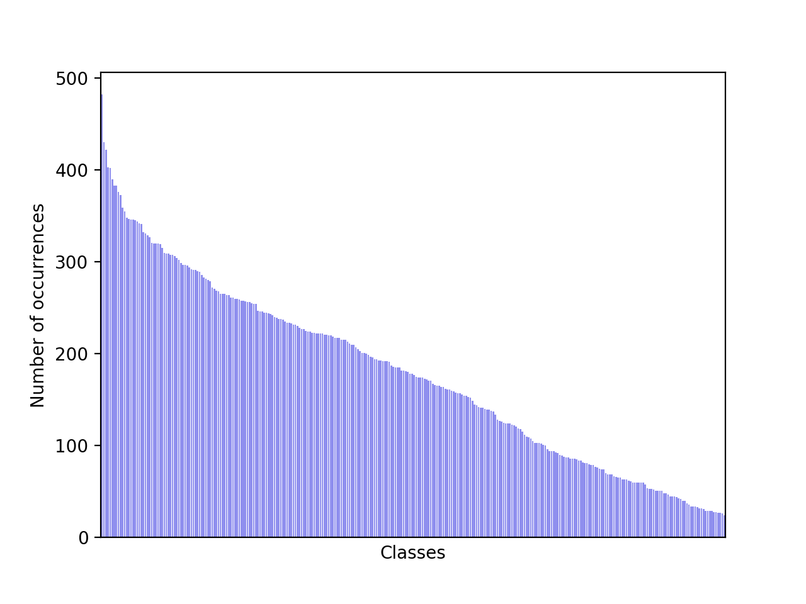
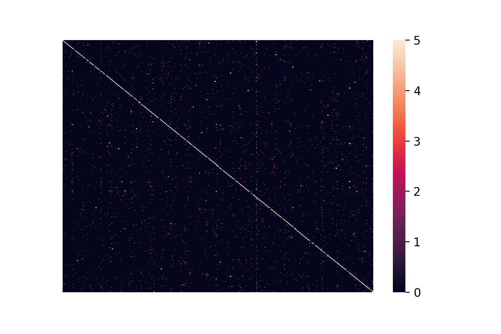

## Transfer Learning with ResNet

At [STATWORX](www.statworx.com), we are very passionate about the field of deep learning. In this blog series, we want to illustrate how an end-to-end deep learning project can be implemented. We use TensorFlow 2.x library for the implementation. The topics of the series include transfer learning, model deployment, building a dashboard and explainability. (COMMENT: Explainability könnte auch losgelöst in einem seperaten blogpost behandelt werden) 

In the first part, we are going to show how transfer learning can be used to tackle the problem of car image classification. We start by giving a brief overview of transfer learning and the ResNet, and then go into the implementation details. The  code presented can be found in [this github repository](https://github.com/fabianmax/car-classification).

### Transfer Learning

Transfer learning is a useful approach when one is faced with the problem of too little available training data. Networks pretrained for a similar problem can be used as a starting point for training new models. The pretrained models are referred to as base models. In our example, a network trained on the [ImageNet](http://www.image-net.org/) dataset can be used as the starting point for building a car model classifier. The main idea behind transfer learning is that the first layers of a network are used to extract important high-level features, which remain similar for the kind of data treated. The final layers (also known as the head) of the original network are replaced by a custom head suitable for the problem at hand. The weights in the head are initialized randomly and the resulting network can be trained for the specific task. There are various ways in which the base model can be treated during training. In a first step, its weights can be fixed. If the learning progress suggests the model not being flexible enough, certain layers or the entire base model can be "unfreezed" and thus made trainable. A further important aspect to note is that the input must be of the same dimensionality as the data the model was trained on, if the first layers of the base model are not modified.

We will next give a brief introduction to the ResNet, a popular and powerful CNN-architecture for image data. Then, we will show how we used transfer learning with ResNet to do car model classifiaction.

### ResNet

The ResNet is a CNN network that is based on the residual block. It enables training deep networks by countering the vanishing gradient problem. In the residual block depicted in the right figure below, the unmodified input is passed on to the next layer by adding it to a layer's output. This modification makes sure that information flow from the input to the deeper layers is possible. The ResNet architechture is depicted in the right network in the left figure below. It is plotted alongside a plain CNN and the VGG-19 network, another standard CNN architecture.

<center> </center>

The ResNet has proved to be a very powerful network architecture for image classification problems. For example, an ensemble of ResNets with 152 layers won the ILSVRC 2015 image classification contest. Pretrained ResNet models of different sizes exist in the `tensorflow.keras.application` module, namely ResNet50, ResNet101, ResNet152 and their corresponing second versions (ResNet50V2, ...). The number following the model name denotes the number of layers the networks have. The available weights are pretrained on the ImageNet dataset. The models were trained on large computing clusters using hardware accelerators for significant time periods. Transfer learning thus enables us to leverage these training results by using the obtained weights as a starting point.

### Classifying Car Model

As an illustrative example of how transfer learning can be applied, we treat the problem of classifying the car model given an image of the car. We will start by describing the dataset set we used and how we can filter out unwanted examples in the dataset. Next, we will go over how a data pipeline can be setup using `tensorflow.data`. In the second section, we will talk you through the model implementation and point out what aspects to be particularly careful about during training and prediction.

#### Data

We used the dataset described in and downloadable from [this github repo](https://github.com/nicolas-gervais/predicting-car-price-from-scraped-data/tree/master/picture-scraper). The author built a datascraper to scrape all car images from the [carconnection website](www.thecarconnection.com). He describes that a lot of images are car interior images. As they are not wanted in the dataset, they are filtered out based on pixel color. The dataset contains 64'467 jpg-images, where the file names contain information on the car's make, model, build year, etc. For a more detailed insight on the dataset, we recommend you consult the original [github repo](https://github.com/nicolas-gervais/predicting-car-price-from-scraped-data/tree/master/picture-scraper). Three sample images are shown below.

<center>  </center>

While checking though the data, we observed that the dataset still contained many unwanted images, e.g. of wing mirrors, door handles, GPS panels or lights. Examples of unwanted images can be seen below.

<center>  </center>

Thus, it is beneficial to additionally prefilter the data to clean out more of the unwanted images.

##### Prefiltering

There are multiple approaches to filter non-car images out of the dataset:

1. Use a pretrained model
2. Train another model to classify car/no-car
3. Train a generative network on a car dataset and use the discriminator

We decided to pursue the first approach since it is the most direct and very good pretrained models exist. If one wanted to pursue the second or third approach, one could e.g. use [this](https://ai.stanford.edu/~jkrause/cars/car_dataset.html) dataset to train the model. The referred dataset only contains images of cars but is significantly smaller than the dataset we used.

We chose the ResNet50V2 in the `tensorflow.keras.applications` module with the pretrained "imagenet" weights. In a first step, we must figure out the indices and classnames of the imagenet labels corresponding to car images.

```python
# Class labels in imagenet corresponding to cars
CAR_IDX = [656, 627, 817, 511, 468, 751, 705, 757, 717, 734, 654, 675, 864, 609, 436]

CAR_CLASSES = ['minivan', 'limousine', 'sports_car', 'convertible', 'cab', 'racer', 'passenger_car', 'recreational_vehicle', 'pickup', 'police_van', 'minibus', 'moving_van', 'tow_truck', 'jeep', 'landrover', 'beach_wagon']
```

Next, the pretrained ResNet50V2 model is loaded.

```python
from tensorflow.keras.applications import ResNet50V2

model = ResNet50V2(weights='imagenet')
```

We can then use this model to make predictions for images. It is essential that the images fed to the prediction method are scaled identically to the images used for training.  The different **ResNet models** are trained on different input scales. It is thus essential to apply the correct image preprocessing. The module `keras.application.resnet_v2` contains the method `preprocess_input` which should be used when using a ResNetV2 network. This method expects the image arrays to be of type float and have values in **[0, 255]**. Using the appropriately pre-processed input, we can then use the built-in predict method to obtain predictions given an image stored at `filepath`:

```python
from tensorflow.keras.applications.resnet_v2 import preprocess_input

image = tf.io.read_file(filename)
image = tf.image.decode_jpeg(image)
image = tf.cast(image, tf.float32)
image = tf.image.resize_with_crop_or_pad(image, target_height=224, target_width=224)
image = preprocess_input(image)
predictions = model.predict(image)
```

There are various ideas of how the obtained predictions can be used for car detection.

* Is one of the `CAR_CLASSES` among the top k predictions?
* Is the accumulated probability of the `CAR_CLASSES` in the predictions greater than some defined threshold?
* Specific treatment of unwanted images (e.g. detect and filter out wheels)

We show the code for comparing the accumulated probability mass over the `CAR_CLASSES`.

```python
def is_car_acc_prob(predictions, thresh=THRESH, car_idx=CAR_IDX):
    """
    Determine if car on image by accumulating probabilities of car prediction and comparing to 		 threshold

    Args:
        predictions: (?, 1000) matrix of probability predictions resulting from ResNet with 											 imagenet weights
        thresh: threshold accumulative probability over which an image is considered a car
        car_idx: indices corresponding to cars

    Returns:
        np.array of booleans describing if car or not
    """
    predictions = np.array(predictions, dtype=float)
    car_probs = predictions[:, car_idx]
    car_probs_acc = car_probs.sum(axis=1)
    return car_probs_acc > thresh
```

The higher the threshold is set, the stricter the filtering procedure is. A value for the threshold that provides good results is `THRESH = 0.1`. This ensures we do not loose too many true car images. The choice of an appropriate threshold remains subjective, so do as you feel just.

The COLAB notebook that uses the function `is_car_acc_prob` to filter the dataset is available in the [github repository](https://github.com/fabianmax/car-classification/blob/master/notebooks/prefilter.ipynb). 

While tuning the prefiltering procedure, we observed the following:

* Many of the car images with light backgrounds were classified as "beach wagons". We thus decided to also consider the "beach wagon" class in imagenet as one of the `CAR_CLASSES`.
* Images showing the front of a car is often assigned a high probability of "grille", which is the grating at the front of a car used for cooling. This assignment is correct but leads the procedure shown above to not consider certain car images as cars since we did not include "grille" in the `CAR_CLASSES`. This problem results in the trade off of either leaving a lot of close up images of car grilles in the dataset or filtering out a number of car images. We opted for the second approach since it yields a cleaner car dataset.

After prefiltering the images using the suggested procedure, 53'738 of originally 64'467 remain in the dataset.

##### Data Overview

The prefiltered dataset contains images from 323 car models. We decided to reduce our attention to the top 300 most frequent classes in the dataset. This makes sense, since some of the least frequent classes have less than 10 representatives and can thus not be reasonably split into a train, validation and test set. Reducing the dataset to images in the top 300 classes leaves us with a dataset containing 53'536 labelled images. The class counts are distributed as follows:

<center></center>

The number of images per class (car model) ranges from 24 to slightly below 500. We can see that the dataset is very imbalanced. It is important to keep this in mind when training and evaluating the model.

#### Data Pipeline: Using tf.data

`tf.data` allows creating elegant input pipelines. The `tf.data.Dataset` is an API for writing efficient data pipelines. The API contains many general methods which can be applied to load and transform potentially large datasets.

```python
def construct_ds(input_files: list,
                 batch_size: int,
                 classes: list,
                 label_type: str,
                 input_size: tuple = (212, 320),
                 prefetch_size: int = 10,
                 shuffle_size: int = 32,
                 augment: bool = False):
    """
    Function to construct a tf.data.Dataset set from list of files

    Args:
        input_files: list of files
        batch_size: number of observations in batch
        classes: list with all class labels
        input_size: size of images (output size)
        prefetch_size: buffer size (number of batches to prefetch)
        shuffle_size: shuffle size (size of buffer to shuffle from)
        augment: boolean if image augmentation should be applied
        label_type: 'make' or 'model'

    Returns:
        buffered and prefetched tf.data.Dataset object with (image, label) tuple
    """
    # Create tf.data.Dataset from list of files
    ds = tf.data.Dataset.from_tensor_slices(input_files)

    # Shuffle files
    ds = ds.shuffle(buffer_size=shuffle_size)

    # Load image/labels
    ds = ds.map(lambda x: parse_file(x, classes=classes, input_size=input_size, 																									 label_type=label_type))

    # Image augmentation
    if augment and tf.random.uniform((), minval=0, maxval=1, dtype=tf.dtypes.float32, 																						 seed=None, name=None) < 0.7:
        ds = ds.map(image_augment)

    # Batch and prefetch data
    ds = ds.batch(batch_size=batch_size)
    ds = ds.prefetch(buffer_size=prefetch_size)

    return ds
```

We will now describe the methods in the `tf.data` we used. `from_tensor_slices()` is one of the available methods for the creation of a dataset. The created dataset contains slices of the given tensor, in this case the filenames. Next, the `shuffle()` method considers `buffer_size` elements at a time and shuffles these items in isolation of the rest of the dataset. If shuffling of the complete dataset is required, `buffer_size` must be chosen larger that the number of entries in the dataset. `map()` allows to apply the function passed as the argument to the dataset. The method parse file used in the `map`() call here can be found in the [github repo](https://github.com/fabianmax/car-classification/blob/743ccd7d6b4ce67407909a028da35bd79948fb26/car_classifier/pipeline.py#L56) and is responsable for reading and resizing the images, for infering the labels from the file name and encoding the labels using a one hot encoder. If the augment flag is set, the data augmentation procedure is activated. Augmentation is only applied in 70% of the cases, since it is beneficial to also train the model on non-modified images. The augmentation techniques used in `image_augment` are flipping, brightness and contrast adjustments. Finally, the `batch()` method is used to group the dataset into batches of `batch_size` elements and the `prefetch()` method enables preparing later elements while the current element is being processed and thus improves performance. If used after a call to `batch()`, `prefetch_size` batches are prefetched.

####  Model Fine Tuning

Below you can see the code that can be used to instantiate a model based on the pretrained ResNet. 

```python
from tensorflow.keras.applications import ResNet50V2
from tensorflow.keras import Model
from tensorflow.keras.layers import Dense, GlobalAveragePooling2D


class TransferModel:

    def __init__(self, shape: tuple, classes: list):
        """
        Class for transfer learning from ResNet

        Args:
            shape: Input shape as tuple (height, width, channels)
            classes: List of class labels
        """
        self.shape = shape
        self.classes = classes
        self.history = None
        self.model = None

        # Use pre-trained ResNet model
        self.base_model = ResNet50V2(include_top=False,
                                     input_shape=self.shape,
                                     weights='imagenet')

        self.base_model.trainable = True
        
        add_to_base = self.base_model.output
        add_to_base = GlobalAveragePooling2D(data_format='channels_last', name='head_gap')													(add_to_base)

        # Add final output layer
        new_output = Dense(len(self.classes), activation='softmax', name='head_pred')															 (add_to_base)
        self.model = Model(self.base_model.input, new_output)
```

The full version of the code on github also contains the option to replace the base model by a VGG16 network, another standard CNN for image classification. In the full version, it is also possible to unfreeze certain layers, meaning we can make the corresponding parameters trainable while leaving the others fixed. As a default, we have made all parameters trainable here.

The TransferModel contains information about the used input shape, the different class labels and also holds the base model and model instances. When using the base model without modification, we must use the same input shape as the one it was originally trained on. When using a pretrained ResNet for another problem that it was initially trained for, we must replace the head of the network. Setting the flag `include_top` to `False` when creating the ResNet allows us to specify that the original head should not be included in the model. We can then add a custom head. We did this here by adding a pooling layer and a dense layer with the required output dimensionality.

Next, we will look at the training procedure. `train` is a class method of the class `TransferModel` introduced above.

```python
from tensorflow.keras.callbacks import EarlyStopping

def train(self,
          ds_train: tf.data.Dataset,
          epochs: int,
          ds_valid: tf.data.Dataset = None):
    """
    Trains model on ds_train for epochs rounds and validates
    on ds_valid if passed

    Args:
        ds_train: training data as tf.data.Dataset
        epochs: number of epochs to train
        ds_valid: optional validation data as tf.data.Dataset

    Returns
        Training history from self.history
    """

    # Define early stopping as callback
    early_stopping = EarlyStopping(monitor='val_loss',
                                   min_delta=0,
                                   patience=10,
                                   restore_best_weights=True)

    callbacks = [early_stopping]

    # Fitting
    self.history = self.model.fit(ds_train,
                                  epochs=epochs,
                                  validation_data=ds_valid,
                                  callbacks=callbacks)

    return self.history
```

As our model is an instance of `tensorflow.keras.Model`, we can train it using the `fit` method. To prevent overfitting, early stopping is used by passing it to the fit method as a callback function. The patience parameter can be tuned to specify how soon early stopping should apply. The parameter stands for the number of epochs after which, if no decrease of the validation loss is registered, the training will be interrupted.

We can describe the training process using a pretrained model as follows: As the weights in the head are initialized randomly and the weights of the base model are pretrained, the training composes of training the head from scratch and fine tuning the pretrained model's weights. It is important to use a small learning rate (e.g. 1e-4) since choosing the learning rate too large can destroy the near optimal pretrained weights of the base model.

The training procedure can be sped up by first training for a few epochs without the base model being trainable. The purpose of these initial epochs is to adapt the heads' weights to the problem. This speeds up the training since when training only the head, much fewer parameters are trainable and thus updated for every batch. The resulting model weights can then be used as the starting point to train the entire model with the base model being trainable. For the car classification problem we are considering here, applying this two stage training however did not achieve notable performance enhancement.

#### Evalution/Prediction

When using the `tf.data.Dataset` API, one must pay attention to the nature of the methods used. The following method in our `TransferModel` class can be used as a prediction method.

```python
def predict(self, ds_new: tf.data.Dataset, proba: bool = True):
    """
    Predict class probs or labels on ds_new

    Args:
        ds_new: New data as tf.data.Dataset
        proba: Boolean if probabilities should be returned

    Returns:
        class labels or probabilities
    """

    p = self.model.predict(ds_new)

    if proba:
        return p
    else:
        return [np.argmax(x) for x in p]
```

 It is important that the dataset `ds_new` is not shuffled, else the predictions obtained will be misaligned with the images obtained when iterating over the dataset a second time. This is the case since the flag `reshuffle_each_iteration` is true by default in the `shuffle` method's implementation. A further important fact is that the `take` method is a generator object. This is important when you want to check out predictions e.g. for only one batch. The following code snippet illustrates the arising problem. `show_batch_with_pred` is a function that plot the images in `ds_batch` annotated with the predictions in `predictions`. 

```python
# Use construct_ds method from above to create dataset
ds = construct_ds(...)

# Take 1 batch of dataset: This creates a generator!
ds_batch = ds.take(1)

# Predict labels for one batch
predictions = model.predict(ds_batch)

# Plot a batch of images with predictions: The next batch will
# be plotted, not the one we made predictions on!
show_batch_with_pred(ds_batch, predictions)
```

The predictions will **not** match the plotted images, since `ds_batch` is a generator and the second call to it will yield the next batch in the dataset `ds`. Thus for the object name to be aligned with its functionality, we would have to rename `ds_batch` to `ds_get_batch`. A function to plot images annotated with the corresponding predictions could look as follows:

```python
def show_batch_with_pred(model, ds, classes, rescale=True, size=(10, 10), title=None):
  	for image, label in ds.take(1):
        image_array = image.numpy()
        label_array = label.numpy()
        batch_size = image_array.shape[0]
        pred = model.predict(ds1, proba=False)
        for idx in range(batch_size):
            label = classes[np.argmax(label_array[idx])]
            ax = plt.subplot(np.ceil(batch_size / 4), 4, idx + 1)
            if rescale:
                plt.imshow(image_array[idx] / 255)
            else:
                plt.imshow(image_array[idx])
            plt.title("label: " + label + "\n" 
                      + "prediction: " + classes[pred[idx]], fontsize=10)
            plt.axis('off')
```

Evaluating model perfomance can be done using `keras.Model'`s `evaluate` method.

##### Model Performance

The model achieves slightly above 70% categorical accuracy for the task of predicting the car model for images from 300 model classes. To better understand the models predictions, it is useful to observe the confusion matrix. Below, you can see the heatmap of the model's predictions on the validation dataset.

<center></center>

We restricted the heatmap to clip the confusion matrix' entries to [0, 5], as allowing for a further span did not significantly highlight any off-diagonal region. As can be seen from the heat map, there is one class that is assigned to examples of almost all classes. This can be seen from the dark red horizontal line two thirds to the right in the figure above. Other than the class mentioned before, there are no evident biases in the predictions.

### Conclusion

In this blog, we have applied transfer learning using the ResNet50V2 to classify the car model from images of cars. Our model achieves 70% categorical accuracy over 300 classes. We found unfreezing the entire base model and using a small learning rate to achieve the best results. In the next post, we will discuss how this model can be deployed using TensorFlow Serving. Stay tuned!

[author class="mtl" title="Über den Autor"]

